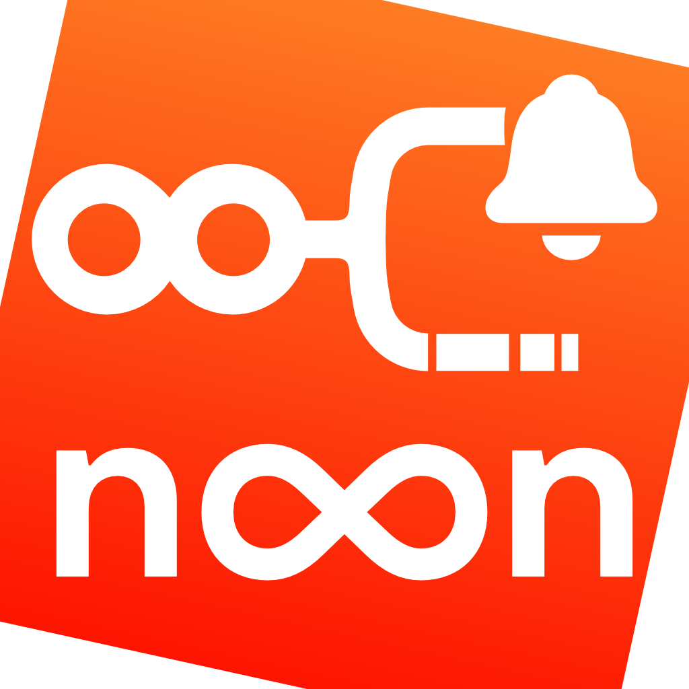

  

<h1 align="center">n8n Infinity</h1>

  <strong>Manage and control your n8n workflows right from your iPhone or iPad.</strong> 
  Your personal n8n companion app for monitoring, executing, and exploring your automation universe.

---

## 🧭 About this repository

This repository is **dedicated to collecting issues, feature requests, and bug reports** for the **n8n Infinity** iOS application.  
If you encounter a problem, want to suggest an improvement, or share feedback — please open a new issue!

👉 [Create an issue](../../issues/new)

---

## 📱 What is n8n Infinity?

**n8n Infinity** is an iOS application designed for users of [n8n](https://n8n.io), the powerful workflow automation tool.  
It connects directly to your own n8n instance and lets you manage your workflows anywhere, anytime — from your pocket.

With n8n Infinity, you can:

- 🎨 **Customize workflow metadata**: set colors, icons, and personalize your dashboard  
- ⭐ **Manage favorites** for quick access to your most-used workflows  
- ⚙️ **Browse and control executions**: filter, search, and inspect detailed execution data  
- 🔔 **Receive notifications** for workflow errors, starts, and completions  
- 🧭 **Use the Execution Navigator** to explore step-by-step execution flow  
- ⏱️ **See running executions** in real time  
- 📊 **View statistics** and historical execution data  
- 🧩 **Use interactive widgets** to trigger workflows, view recent runs, and more — directly from your home screen  
- 🚀 **Launch workflows** right from the Control Center  
- 🔗 **Trigger workflows from the Shortcuts app**  
- 🏷️ **Manage tags** and organize workflows easily  
- 🧠 **Interact with the (unofficial) n8n API**  
- 🔄 **Enable, disable, or trigger workflows** directly from your device  

---

## 🌍 Compatibility

- **iOS 17+** (optimized for iPhone and iPad)  
- Works with **self-hosted n8n instances** & **n8n hosted cloud instances** (requires API access)  

---

## 🧰 Feedback & Support

If you find a bug 🐛 or have a feature idea 💡:

1. Check the [existing issues](../../issues)
2. If your issue is not listed, [open a new one](../../issues/new)
3. Include screenshots, logs, or steps to reproduce if applicable  

---

## 📸 Screenshots

*(Coming soon)*

---

## ❤️ Contribute

At this stage, contributions are focused on **feedback, testing, and feature suggestions**.  
If you’d like to help shape n8n Infinity, join the discussion via GitHub Issues.

---

## 📄 License

n8n Infinity is a proprietary iOS application.  
This repository is **only** for community discussion, issue tracking, and feature feedback.

---

  Made with ❤️ for n8n users by <strong>Wonderlink</strong>

